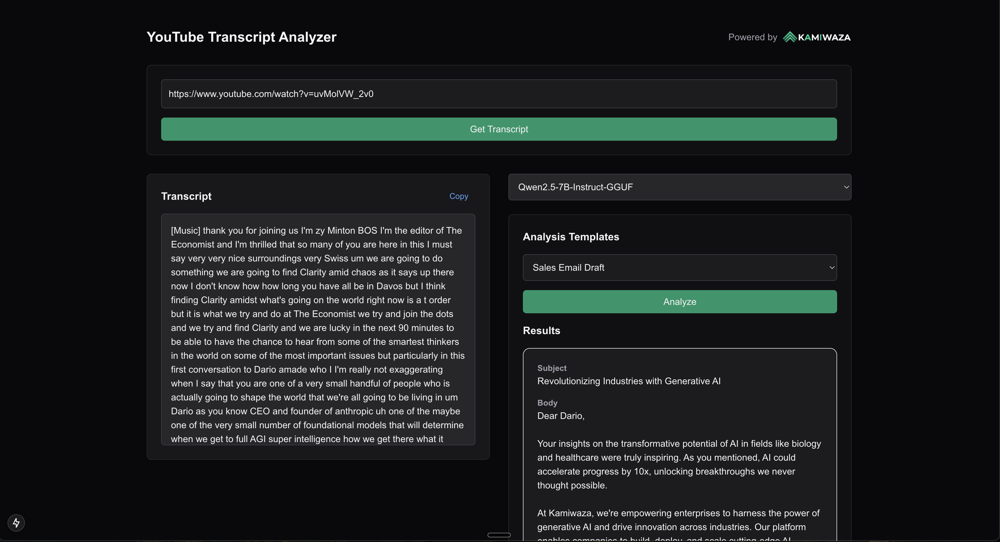
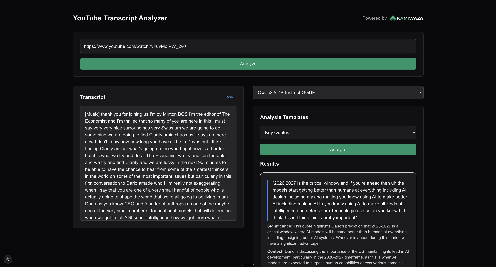

# YouTube Transcript Analyzer



A powerful tool that extracts and analyzes YouTube video transcripts using AI. Powered by [Kamiwaza.ai](https://kamiwaza.ai), this application demonstrates how to build practical AI-powered content analysis tools.

## 🚀 Features

- Extract transcripts from any YouTube video
- Multiple analysis templates:
  - Key Quotes Extraction
  - Sales Email Generation
  - Main Points Summary
  - Custom Analysis

## 🛠 Getting Started

1. Clone the repository
2. Copy the environment variables:
```bash
cp .example.env .env.local
```
3. Update the environment variables in `.env.local`
4. Install dependencies:
```bash
npm install
```
5. Run the development server:
```bash
npm run dev
```

Open [http://localhost:3000](http://localhost:3000) to see the application.

## 💡 Use Cases & Customization



The project includes example schemas for different types of analysis, which can be adapted for various use cases:

### Education
- Lecture summarization
- Study guide generation
- Key concept extraction
- Quiz question generation

### Sales & Marketing
- Sales opportunity identification
- Competitor analysis
- Market research insights
- Customer testimonial extraction

### Content Creation
- Video summarization
- Content repurposing
- Social media snippet generation
- Blog post outline creation

### Research & Analysis
- Interview transcription analysis
- Qualitative data coding
- Theme identification
- Research summary generation

You can customize the analysis templates by modifying the schemas in `app/api/transcript/analyze/route.ts`. Each schema defines the structure of the extracted information:

```typescript
const customSchema = z.object({
  // Define your custom schema here
  topics: z.array(z.string()),
  insights: z.array(z.object({
    topic: z.string(),
    details: z.string()
  }))
});
```

## 🤖 About Kamiwaza.ai

The AI capabilities of this project are powered by Kamiwaza.ai, a production-ready AI inference platform. Kamiwaza provides:

- Secure and scalable model inference
- Built-in authentication and user management
- High-performance AI model deployment
- Cost-effective inference solutions
- Enterprise-grade reliability

[Learn more about Kamiwaza](https://kamiwaza.ai)

